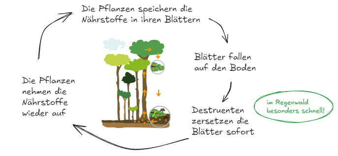
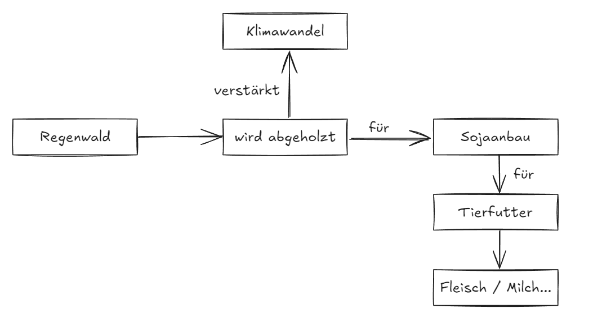

[🏠 Zurück zur Übersicht](../../index)

### Wichtiger Hinweis zu den Hefteinträgen:
Es kann sein, dass die genauen Wörter in deinem Heft ein bisschen anders sind. Das ist grundsätzlich nicht schlimm. Trotzdem sollten deine Hefteinträge alle vollständig sein. Es ist weiterhin deine Aufgabe, die Hefteinträge selbstständig mitzuschreiben und wenn du krank bist, dir bei einem Mitschüler oder einer Mitschülerin zu besorgen!

---

## Warum begann der europäische Kolonialismus?

Die drei G:

1. **Gold**: Suche nach Reichtum
2. **Gewürze**: Hohe Preise in Europa, Umgehen des Landwegs
3. **Glaube**: Verbeitung des Christentums (Missionierung)

 >ℹ️Merksatz: Der Kolonialismus begann, weil die Europäer nach Reichtum und wertvollen Gewürzen suchten und ihren Glauben verbreiten wollten. 

---

## Warum zerstören Menschen Statuen von Kolumbus?

### Kolumbus "entdeckt" Amerika

- Er möchte nach Westen, einmal um den Erdball, nach Asien segeln.
- Er landet dabei auf einer Insel vor Mittelamerika.
- Nennt die Einwohner "Indianer", weil er nicht versteht, dass er nicht in Indien ist. 
  
### Kolumbus auf der Insel "Hispaniola"

- möchte die Einwohner versklaven und bekämpfen
- plant von Anfang an Gewalt gegen die "Taino"

>Merke: weil durch Kolumbus sehr viele Menschen gestorben sind

*Tipp: Hier findest du ein gutes Video, dass nochmal das wichtigste zu Kolumbus erklärt: [hier klicken, um zum Video zu kommen](https://www.planet-wissen.de/geschichte/neuzeit/entdeckung_amerikas/index.html)*

---

## Wie ist der Regenwald aufgebaut?

**der Regenwald ist in Stockwerken aufgebaut, dadurch:**
- kann das Sonnenlicht optimal genutzt werden
- kann sich jede Pflanze genau an ihren Standort anpassen
- bietet jedes Stockwerk Platz für unterschiedliche Arten

>Wichtig!
>Die Stockwerke sind perfekt aufeinander abgestimmt. Wird ein Stockwerk gestört, leiden alle anderen auch. 

---

## Woher bekommen Pflanzen im Regenwald ihre Nährstoffe?

>Merke dir: 
>Nährstoffe sind nur in den Pflanzen, aber nicht im Boden gespeichert!

---

## Wie verändert sich der Amazonas-Regenwald?

- **1984:** dichter Regenwald
- **2020:** mehr Felder, mehr Straßen, mehr Häuser und Geschäfte

*Große Teile des Regenwalds sind in den letzten Jahren verschwunden und Feldern, Straßen und Siedlungen gewichen. *

>Merke dir: 
>In ganz Südamerika wird der Regenwald abgeholzt (Waldverlust).

---

## Warum ist der Amazonas-Regenwald so wichtig für das Klima?

>Merke dir:
>CO2 sorgt dafür, dass es auf der Erde wärmer wird. 
>Das bedeutet, dass es auf der Erde ohne den Amazonas-Regenwald viel wärmer werden würde!

---
## Wieso wird der Regenwald für Soja abgeholzt?

>Merke: Auf den abgeholzten Flächen wird Soja angebaut, das in Deutschland als Tierfutter verwendet wird, für Fleisch- und Milchprodukte. 

---
## Wieso wird der Regenwald auch für Kakao und Kaffee abgeholzt?

### Traditioneller Anbau im Schatten:
- große Bäume bleiben stehen
- der Regenwald bleibt gesund 
- Kaffee / Kakao sind teurer

### Moderne Monokulturen:
- es wächst nur noch eine Art Pflanze
- viele Bäume werden gefällt
- Kaffee / Kakao ist billiger

>Merke: Da Kaffee und Kakao oft als Monokultur angebaut werden, damit die Preise billig bleiben und die Gewinne für die Schokoladen-Firmen hoch.

---
## Wie eroberte Cortez das Aztekenreich?

>Achtung: Besonders: ca. 600 spanische Soldaten besiegten das riesige Reich der Azteken!

- moderne Waffen und Pfere
- Spanier nutzen Gastfreundschaft aus
- Bündnisse mit Feinden der Azteken
- Azteken sind empfindlich für unbekannte Krankheiten

### Folgen der Eroberung:

- Tod durch Krankheiten
- Herrschaft der Spanier, Unterdrückung
- Verlust der Kultur
- Austausch zwischen Europa und Mittelamerika

---

## Wie sah das Leben als Sklave in Amerika aus?

### 1. Arbeit
- Bis zu 18 Stunden täglich
- schwere Arbeit auf dem Feld

### 2. Lebensbedingungen
- Einfache Hütten
- Schlechte Ernährung
- Keine Bildung erlaubt

### 3. Rechtliche Stellung
- Eigentum des Besitzers, wie ein Gegenstand
- Keine Menschenrechte
- Familien wurden getrennt

### 4. Widerstand
- Fluchtversuche
- Spirituals (religiöse Lieder)
- Bewahrung der Kultur

