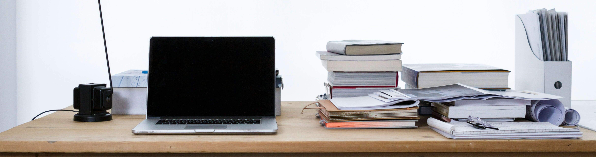

# Aktuelles Unterrichtsmaterial

➡️ 6️⃣ Mittwoch 14.05. GPG, Klasse 6, 
➡️ 7️⃣ Mittwoch 14.05. GPG, Klasse 7: [[Das_Ende_des_ersten_Weltkriegs]]
 

---
## Archiv: Unterrichtsmaterial

hier findest du Arbeitsblätter, weiterführende Informationen und teilweise Hefteinträge zu den letzten Stunden. Bitte **wähle deine Klasse**, um zu dem Material zu kommen.

- [Klasse_6_GPG_Kunst](Klasse_6_GPG_Kunst.md)
- [Klasse_7_GPG_Kunst](Klasse_7_GPG_Kunst.md)

 